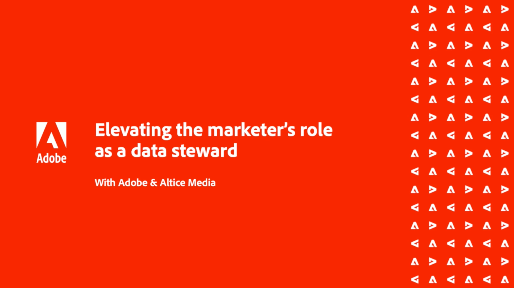

# Customer Data Management - Voices {#overview}

Welcome to Customer Data Management Voices. Your destination as a customer data management technical and marketing practice leader and specialist.

This page is your one stop shop to hear from your peers, get inspired and learn about developments in martech. No registration required, just click and watch.

>[!TIP]
>
>**All recorded sessions are listed in the navigation on the left**.

## Customer Data Management Building Blocks

<table>
  <tr>
   <td>
      
      

         <a href="./help/events/evolve-your-audience.md"><strong>Evolving Your Audience Center of Excellence</strong></a>
          
      

      

         
         As the platforms that facilitate the management of customer data, audiences and activation programs must also evolve. So too do the people and processes that support these platforms. An Audience Center of Excellence (COE) model has long been established as the optimal way to support Data Management Platforms (DMPs).
        

            <em>To supplement this video, you may also download <a href="./assets/whitepaper-evolving-the-audience-center-of-excellence.pdf"> whitepaper</a>.</em>
        

       

    </td>
   <td>
      
      

         <a href="./help/building-better-experiences-with-customer-profiles.md"><strong>Building better experiences with customer profiles</strong></a>
      

      

         
         Providing an excellent customer experience requires us to know about our customers. Merging everything that we know about a customer into a real-time customer profile allows us to give them an experience that will keep them coming back for more.
      

    </td>
   <td>
      
      

         <a href="./help/how-marketing-teams-are-improving-data-management-strategies.md"><strong>How Marketing Teams are Improving Data Management Strategies</strong></a>
      

      

         
         An infinite amount of user information can be beneficial, but most companies struggle with efficiently capturing data at scale and in real time to inform business decisions. In this webinar, learn how you can
         <ul style="list-style-type:square;">
            <li>Improve their data collection and management practices</li>
            <li>Remove data collection friction points</li>
            <li>Best practices for working with multi-solution data collection setups</li>
            <li>Increase performance on your web properties</li>
         </ul>
      

    </td>
  </tr>
</table>

## Audience and Profile Data Governance & Privacy

<table>
  <tr>
   <td>
      
      

         <a href="https://experienceleague.adobe.com/docs/platform-learn/tutorials/privacy/ten-considerations-for-responsible-customer-data-management.html"><strong>10 considerations for Responsible Customer Data Management</strong></a>
          
      

      

         
         Volatile market forces and disparate consumer privacy requirements can present daunting scenarios for the digital marketer. To keep campaigns on the right side of regulations, marketing teams need their IT counterparts to have a streamlined process for future-proofing the data governance process — one that ideally empowers everyone to follow and enforce rules of responsible usage of consumer data. Hear from Adobe and Scotiabank Digital on key considerations for responsible data management.
       

    </td>
    <td>
      
      

         <a href="https://experienceleague.adobe.com/docs/platform-learn/tutorials/privacy/elevating-the-marketers-role-as-a-data-steward.html"><strong>Elevating the Marketer’s Role as a Data Steward</strong></a>
          
      

      

         
         The role of the ‘data steward’ spans across disciplines and has become an added responsibility for the marketer. 
         In this webinar, experts will share:
            <ul style="list-style-type:square;">
                <li>Examples of how to govern customer data within a marketing context of collection, segmentation, and audience activation</li>
                <li>How to Incorporate consent-based strategies that lead with consumer trust and seamlessly integrate within the consumer journey</li>
                <li>Data steward responsibilities within the marketer’s role with efficiency and confidence</li>
            </ul>
       

    </td>
  </tr>
</table>

## Industry Discussions

<table>
  <tr>
     <td>
      
      

         <a href="./help/build-superb-experiences-with-your-first-party-data.md"><strong>Build Superb Experiences with your First-Party Data</strong></a>
      

      

         
         Third-party cookies may be going away, but first-party data is still yours to own, manage, and protect. Find out how to fuse first-party cookie data with consent-based durable identifiers to gain access to the “golden” customer record.
      

    </td>
     <td>
      
      

         <a href="./help/data-collaboration-in-the-first-party-data-context.md"><strong>Data Collaboration in the First-party Data Context</strong></a>
      

      

         
            Delivering on the experience promise, with access to less data. Whether you’re an advertiser, publisher, or agency, this webinar will help unlock the opportunities for data collaboration in a future without third-party cookies.
      

    </td>
     <td>
      
      

         <a href="./help/the-future-of-data-management-and-the-changing-environment.md"><strong>The Future of Data Management and the Changing Environment</strong></a>
      

      

         
         As market forces bring change to our digital landscape, businesses need to adapt to a new reality regarding data governance, identity resolution, and how to engage prospects and pseudonymous visitors with meaningful content. To that end, there are many different paths emerging to leverage durable identifiers with external systems to achieve scale. In this webinar, see how Adobe and 451 Research are thinking about the future of technology and data to address the new marketing environment and begin preparing your business for the future of data management.
      

    </td>
   <td>
      
      

         <a href="./help/brands-vs-consumers.md"><strong>A Tale of Two Perceptions - Brands vs. Consumers</strong></a>
          
      

      

         
         Today, marketers are buried in the clutter of information dedicated to identity practices. Only 37% of marketing professionals said they are prepared for a cookieless future, according to recent research from Adobe and [!DNL Advanis]. In this webinar Adobe unpacks the understanding and readiness level of advertisers and publishers for a cookieless future, the impact to their use cases, and their perception of the wider ecosystem.
        

            <em>To supplement this video, you may also download <a href="./assets/help/assets/whitepaper-a-tale-of-two-perceptions.pdf"> whitepaper</a>.</em>
        

        

            <em>Updated insights on<a href="https://business.adobe.com/blog/perspectives/a-tale-of-two-perceptions-readiness-for-a-cookieless-future"> business.adobe.com</a>.</em>
        

       

    </td>

  </tr>
</table>